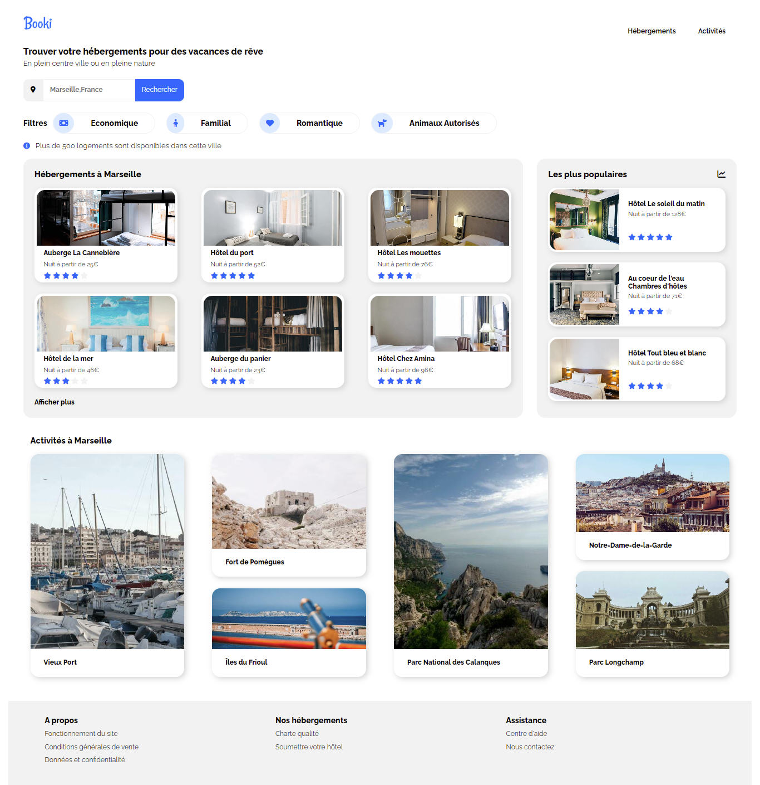

# Booki – Maquette d’une plateforme de réservation

## 🖥️ Présentation

Ce projet est mon **tout premier exercice pratique en développement web** réalisé durant ma formation de BTS Front-end. L’objectif était de **reproduire fidèlement une maquette fournie au format PDF** pour une plateforme fictive de réservation d’hébergements et d’activités à Marseille.

Il s'agit d'une **intégration statique** en HTML et CSS, sans JavaScript, dans le cadre d'une consigne stricte : **respect pixel-perfect de la maquette, sans ajout personnel ni liberté artistique**.

---

## 🎯 Objectifs pédagogiques

- Apprendre à structurer une page web avec du **HTML5 sémantique**
- Appliquer les bases du **CSS3** pour styliser le contenu
- Savoir utiliser les **Flexbox** pour construire des mises en page flexibles
- Comprendre les fondements du **responsive design** avec les media queries
- Respecter un **cahier des charges strict** et une maquette imposée

---

## 🛠️ Compétences développées

- Organisation du code HTML selon une structure logique et lisible
- Mise en page fluide avec `flexbox` et `width` adaptatives
- Réutilisation de composants (`card`, `filtres`, etc.)
- Gestion des polices via **Google Fonts**
- Intégration d’**icônes Font Awesome**
- Application d’un **reset CSS (normalize)** pour homogénéiser l’affichage
- Utilisation des **media queries** pour adapter la mise en page sur mobile

---

## 📐 Contraintes techniques

- **Aucune utilisation de JavaScript**
- Respect de la **maquette PDF imposée**
- Design **responsive obligatoire**
- Pas de liberté créative autorisée (contenu, images, structure…)
- Intégration des assets fournis (images, polices, icônes…)

---

## 🔧 Technologies utilisées

- HTML5
- CSS3
- Flexbox
- Media Queries
- Normalize.css
- Font Awesome
- Google Fonts (`Raleway`)

---

## 📱 Responsive design

Le site s’adapte automatiquement aux tailles d’écrans desktop et mobile.  
Les ajustements ont été réalisés via une feuille dédiée : `media_queries.css`.

---

## 🖼️ Aperçu visuel

---

## 🚀 Comment voir le projet

1. Télécharger ou cloner ce dépôt
2. Ouvrir le fichier `index.html` dans votre navigateur

Aucun serveur local n’est nécessaire, le projet est entièrement statique.

---

## 👩‍💻 Crédits et mentions

Ce projet a été réalisé dans le cadre de ma formation BTS Front-End.  
Tous les visuels, contenus et consignes m'ont été fournis à des fins pédagogiques.  
Aucun contenu n’a été modifié ni personnalisé.

---

